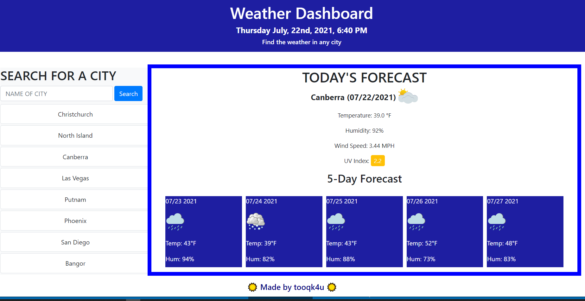

# Weather-Dashboard

[Weather Dashboard](https://tooqk4u.github.io/Weather-Dashboard/)

To use this application enter a city into the searchbox and click the search button.

This project takes a users input of a city name in the search box and generates weather data for that city. The data includes 
temperature, humidity, wind speed and ultra violet light index (UV). The UV index produces a number indicating the UV leval 
and is color coded to represent good (green), (fair), and bad (red) conditions. Furthermore when the current weather is 
generated a 5-day forecast is also created on the screen. Each time a user inputs a city name it is saved to local data and 
appears under the search box. If the user so chooses they may click on any of their previous searches to view the current and 
5-day weather conditions for that city again. The application can be viewed on any screensize and will render appropriately. 

I built the project this way because it resembled the mock up we were given but I added the day/date/time because I felt that was important, especially the day 
of the week in the 5 day portion.

Again I had issues with local storage but was able to get it resolved with some help from google 
search. I have developed my own wireframe type method that gives me a very clear understanding of where each "container" is and their boundaries. It also flexes down nicely without bootstrap but usng bootstrap was a requirement and I do think their grid system is the easiest to use. J query was also used and it is a nice adaptation to use but I do not want to rely to 
heavily on a library I am being told is becoming obsolete.. I really did not have to many issues with GitHub for this project 
which is a first.

The items I would like to add to improve this project is connect the weathermaps API for icons because to list all the conditions in the app thru the switch statement is tedious. Also the UV index API I used is deprecated so I would instead change that part of the code to access the newer API that is not deprecated. 
In addition I would like to make is so the user can either click the search button or hit enter to submit their city of choice.